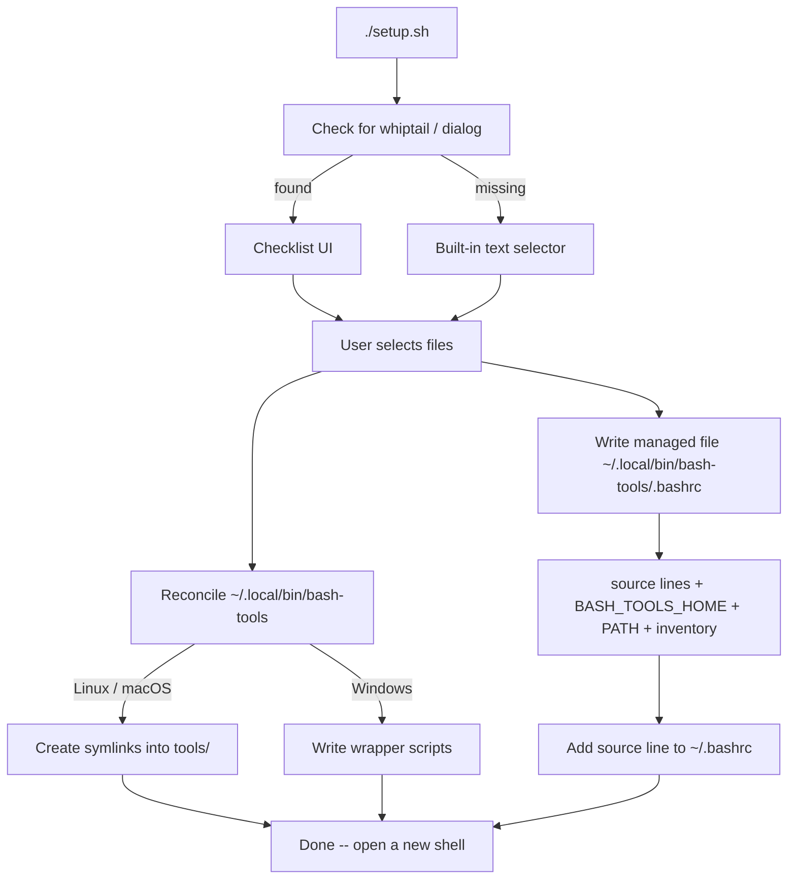

# 🧰 bash-tools

**A personal shell-configuration manager: pick the aliases, environment files, functions, and command-line tools you want, and wire them into your shell without ever touching the repository.**

## 📘 1. Overview

`bash-tools` collects four kinds of shell content into a single repository and exposes a
selectable subset of them to your interactive Bash shell. A single script, `setup.sh`,
scans the repository, shows a checklist of everything available, and reconciles your
selection into `~/.bashrc` and `~/.local/bin/bash-tools/`.

| Aspect | Detail |
|--------|--------|
| Shell | Bash |
| Entry point | `./setup.sh` |
| State locations | `~/.local/bin/bash-tools/.bashrc` (managed config file, sourced from `~/.bashrc`), `~/.local/bin/bash-tools/` (tool commands) |
| Repository mutation | None -- the repo is treated as immutable |
| Dependencies | Optional `whiptail` or `dialog`; falls back to a built-in text selector |
| Platforms | Linux, macOS, Windows (Git Bash / MSYS / Cygwin) |

For agent-specific contributor guidance, see [`AGENTS.md`](AGENTS.md).

## 📦 2. Repository Structure

```
bash-tools/
├── setup.sh                  # the only entry point; installs and reconciles everything
├── aliases/                  # *.bash -- sourced from ~/.bashrc
│   ├── common-alias.bash
│   └── gnome-alias.bash
├── environment/              # *.bash -- sourced from ~/.bashrc (PATH / env exports)
│   ├── flutter-env.bash
│   ├── golang-env.bash
│   ├── git-prompt.bash
│   └── wsl-terminal.bash
├── .docs/
│   └── dev/                  # design specs for multi-file tools (not scanned by setup.sh)
│       └── add-notes.md
├── functions/                # *.bash -- sourced from ~/.bashrc (shell functions)
│   ├── git-navigation.bash
│   └── add-notes-completion.bash
└── tools/                    # *.sh -- exposed as commands on your PATH
    ├── age-pdf.sh
    ├── appimage-install.sh
    ├── cleanup-old-kernels.sh
    ├── compare-copy.sh
    ├── copy-realpath.sh
    ├── git-prune-local.sh
    ├── nvidia-prime-run.sh
    ├── add-notes.sh
    └── add-notes/            # support assets for add-notes (lib/, web/ — not a command)
```

> A `tools/<name>/` subdirectory (like `tools/add-notes/`) is **not** scanned as a
> command — `setup.sh` only exposes top-level `tools/*.sh` files. Such directories are
> the place to keep a multi-file tool's helper scripts and assets.

Files in `aliases/`, `environment/`, and `functions/` are **sourced** into the shell.
Files in `tools/` become **commands**: the command name is the filename with `.sh`
stripped (for example, `tools/git-prune-local.sh` becomes the `git-prune-local` command).

## 🏗️ 3. How It Works



Key behaviors:

- **The repository is immutable.** `setup.sh` never writes files, metadata, or symlinks
  inside the repo. All persistent state lives in `~/.local/bin/bash-tools/` and a single
  managed `source` line in `~/.bashrc`.
- **`BASH_TOOLS_HOME`** is the canonical repository root. If unset, it is inferred from
  the location of `setup.sh`, then exported from the managed file.
- **Managed file.** The generated file `~/.local/bin/bash-tools/.bashrc` holds the
  `BASH_TOOLS_HOME` export, the `PATH` addition, the `source` lines, and the inventory.
  It is overwritten on every run; edit the repository files, not this file. `~/.bashrc`
  only sources it, via a single line marked `# bash-tools managed source` (added once).
- **Tools: symlink vs wrapper.** On Linux/macOS each enabled tool is a symlink into
  `tools/`. On Windows shells, where `ln -s` often silently copies, a small wrapper
  script is written instead.
- **Reconciliation.** Each run re-enables selected items, removes deselected ones, and
  prunes entries for files deleted from the repo. Unrelated entries are left untouched.
- **Inventory.** Known files are recorded as `# bash-tools inventory:` comments in the
  managed file so the next run can report newly added or removed files.

## 🚀 4. Installation & Usage

```bash
git clone <repo-url> bash-tools
cd bash-tools
./setup.sh
```

In the selector, check the files you want enabled and confirm. Then start a new shell or
reload the current one:

```bash
source ~/.bashrc
```

Re-run `./setup.sh` any time you add files, remove files, or want to change the selection.
It is idempotent.

### Optional checklist UI

For a checkbox-style terminal UI, install `whiptail` or `dialog`. `setup.sh` never
installs packages automatically; it prints a per-distro hint and otherwise uses the
built-in text selector.

| Package manager | Install command |
|-----------------|-----------------|
| pacman (Arch / CachyOS / Manjaro) | `sudo pacman -S libnewt` |
| apt | `sudo apt-get install whiptail` |
| dnf | `sudo dnf install newt` |
| zypper | `sudo zypper install newt` |
| apk | `sudo apk add newt` |

## 🔧 5. Tools

Each enabled tool becomes a command named after its file (minus `.sh`).

| Command | Source | Purpose |
|---------|--------|---------|
| `age-pdf` | `tools/age-pdf.sh` | Age a PDF so it looks like an old scan, photocopy, or low-quality B&W document |
| `appimage-install` | `tools/appimage-install.sh` | Install an AppImage as a desktop application (user or system scope) |
| `cleanup-old-kernels` | `tools/cleanup-old-kernels.sh` | Remove old kernels via `dnf`, keeping the latest |
| `compare-copy` | `tools/compare-copy.sh` | Compare a file copy between a target and source directory |
| `copy-realpath` | `tools/copy-realpath.sh` | Copy a file's absolute path to the clipboard (`xclip`) |
| `git-prune-local` | `tools/git-prune-local.sh` | Prune local Git branches (`--force`/`-f` to force-delete) |
| `nvidia-prime-run` | `tools/nvidia-prime-run.sh` | Run a command on the NVIDIA GPU via PRIME render offload |
| `add-notes` | `tools/add-notes.sh` | Capture meeting notes as clean Markdown under a freeform path in the current dir, with a built-in tree search UI and git auto-commit |

Many tools provide a usage block; run them with `--help` where supported.

### `add-notes` — meeting notes in any directory

Run `add-notes` inside any directory to turn it into a notes repository. The first
argument is a freeform, multi-level **path** describing your own structure:

```bash
add-notes garagehub/daily-standup                      # -> garagehub/daily-standup/<date>.md
add-notes garagehub/auth/design-review --from ./raw.md # multi-level, from a file
add-notes garagehub/daily-standup                      # from the clipboard (default)
add-notes garagehub/daily-standup/jun-12-2026.md       # backfill a past note (exact filename)
add-notes garagehub/design-review --title "Kickoff"    # optional entry title, shown in the UI
add-notes --delete garagehub/daily-standup/jun-12-2026.md  # delete a note (+reindex, commit)
add-notes --rename garagehub/daily-standup/jun-12-2026.md garagehub/retro  # move, keep name
add-notes --rename garagehub/retro/jun-12-2026.md garagehub/retro/jun-11-2026.md  # exact rename
add-notes --rebuild                                    # refresh ./.web + index, no note added
```

- The note is saved at `<PATH>/<date>.md`, or at the exact file when `PATH` ends in
  `.md`. Each folder segment is **slugified** (lowercase, hyphenated); the original
  text is kept in the note's frontmatter `title`.
- Content is cleaned of AI cruft and given YAML frontmatter. With `--from-clipboard`
  (the default), **formatted (HTML) clipboard** content is converted to Markdown
  automatically (clipboard2markdown-style); otherwise plain text is used. `--from FILE`
  reads from a file instead.
- The current directory becomes the notes repo: it must be the **git repository root**
  (running from a subdirectory exits with an error). It is `git init`-ed on demand, and
  must have a clean working tree if already tracked. Each note is committed; if a remote
  is configured it is pushed too.
- A self-contained search/browse UI is deployed to `./.web` (open `index.html` — no
  server needed); it renders your notes as a collapsible **tree** of any depth. The
  tree panel is resizable (drag the divider; double-click resets) and scrolls
  horizontally for long names. It is refreshed automatically when the tool is
  updated, tracked via `.web/.tool-version`.
- `--title TEXT` attaches an optional human title to the entry (frontmatter `label`);
  the UI shows it next to the date (`jul-17-2026 — Kickoff`) and search matches it.
  Untitled entries display as before.
- `--delete PATH` removes a note (asks for confirmation, `ADD_NOTES_DELETE=yes|no` to
  skip), prunes emptied folders, rebuilds the index, and commits. `--rebuild`
  force-redeploys `./.web` and rebuilds the index without adding a note — use it to
  pick up a tool update (or repair `.web`) in a repo you're only reading.
- `--rename OLD NEW` moves or renames a note: NEW ending in `.md` is the exact target;
  otherwise NEW is a destination folder and the file keeps its name. The note's
  frontmatter title (and, on a filename change, its date) follows the new location;
  an existing target is never overwritten.
- Tab-completion drills through the path (directories under the current repo) and the
  flags, and completes note files after `--delete`; enabled automatically via
  `functions/add-notes-completion.bash`. Requires `python3` and `git`.

## ⚙️ 6. Aliases, Environment & Functions

| File | Type | Provides |
|------|------|----------|
| `aliases/common-alias.bash` | aliases | `ll`, `to-clipboard` |
| `aliases/gnome-alias.bash` | aliases | `gedit` (maps to `gnome-text-editor`) |
| `environment/flutter-env.bash` | environment | Flutter + Android SDK env vars and PATH |
| `environment/golang-env.bash` | environment | Go env (`GOPATH`, `GOROOT`) and PATH |
| `environment/git-prompt.bash` | environment | Two-line, Git-aware Catppuccin Macchiato prompt |
| `environment/wsl-terminal.bash` | environment | WSL: tab title follows `cd`; Windows Terminal duplicates tabs/panes in the same directory |
| `functions/git-navigation.bash` | function | `goto-git-root` -- cd to the current repo root |
| `functions/add-notes-completion.bash` | function | Tab-completion for the `add-notes` command (cwd-aware) |

## 📝 7. Adding New Content

**An alias, environment file, or function:**

1. Drop a `*.bash` file into `aliases/`, `environment/`, or `functions/`.
2. Run `./setup.sh` and check the new file.

**A tool / command:**

1. Add a `*.sh` file to `tools/` with a `#!/usr/bin/env bash` shebang.
2. Make it executable: `chmod +x tools/your-tool.sh` (commit the executable bit).
3. Run `./setup.sh` and select it. The command name is the filename minus `.sh`.

**A post-setup hint:** any alias/env/function/tool file may have a sibling
`<filename>.hint` Markdown file (e.g. `environment/wsl-terminal.bash.hint`).
`setup.sh` prints it after every run in which the file is enabled — handy for
follow-up steps outside the shell, like Windows Terminal settings. Hint files
never appear in the selector.

Conventions for new scripts: start with `#!/usr/bin/env bash` and `set -euo pipefail`,
provide a usage/help block, and commit using Conventional Commits with a scope
(for example, `feat(git-prompt): ...`, `chore(setup): ...`).

## 🔍 8. Troubleshooting

| Issue | Cause | Fix |
|-------|-------|-----|
| Tool command "not found" | New shell not started, or PATH not refreshed | Run `source ~/.bashrc` or open a new shell |
| Command runs the wrong/old script | Tool not re-selected after rename | Re-run `./setup.sh` and confirm the selection |
| "Tool is not executable" warning | Missing execute bit on a `tools/*.sh` file | `chmod +x tools/<name>.sh`, then re-run setup |
| No checkbox UI appears | `whiptail`/`dialog` not installed | Install one (see section 4) or use the text selector |
| On Windows, tools are copies not links | `ln -s` copies on Git Bash/MSYS/Cygwin | Expected -- setup writes wrapper scripts instead |
| Changes to the managed file vanish | `~/.local/bin/bash-tools/.bashrc` is regenerated each run | Edit the source files in the repo, not the managed file |

## 📜 9. Changelog

| Date | Change |
|------|--------|
| _Initial_ | Setup script, shell config files, and command-line tools |
| 2026-06-23 | Add `add-notes` meeting-notes tool (+ `add-notes/` assets, completion function) |
| 2026-06-23 | `add-notes`: freeform multi-level path arg, `--from`/`--from-clipboard` flags, tree-based web UI |
| 2026-06-23 | `setup.sh`: move managed shell config into `~/.local/bin/bash-tools/.bashrc`, sourced from `~/.bashrc` (no more delimited block) |
| 2026-07-16 | Add `CLAUDE.md` (AI session context, imports `AGENTS.md`) and `.docs/dev/` design specs (starting with `add-notes`) |
| 2026-07-16 | `add-notes`: fix web UI sidebar ordering — notes now sort chronologically (newest first) instead of alphabetically by date string |
| 2026-07-17 | `add-notes`: add `--rebuild` (refresh `.web` + index without adding a note), `--delete PATH` (remove a note, reindex, commit), and optional `--title TEXT` (entry title shown as `date — title` in the UI, stored as frontmatter `label`) |
| 2026-07-17 | `add-notes`: add `--rename OLD NEW` (move/rename a note; folder NEW keeps the filename, `.md` NEW renames exactly; frontmatter title/date follow the new location) |
| 2026-07-17 | `add-notes`: web UI sidebar is now resizable (drag divider, width persisted, double-click to reset) and scrolls horizontally so long names are fully visible |
| 2026-07-24 | Add `environment/wsl-terminal.bash` (WSL tab title + Windows Terminal same-directory tab duplication); remove root `title.sh` prototype |
| 2026-07-24 | `setup.sh`: print post-setup hints from sibling `<filename>.hint` Markdown files; add `environment/wsl-terminal.bash.hint` (Windows Terminal settings for title + same-dir duplication) |
